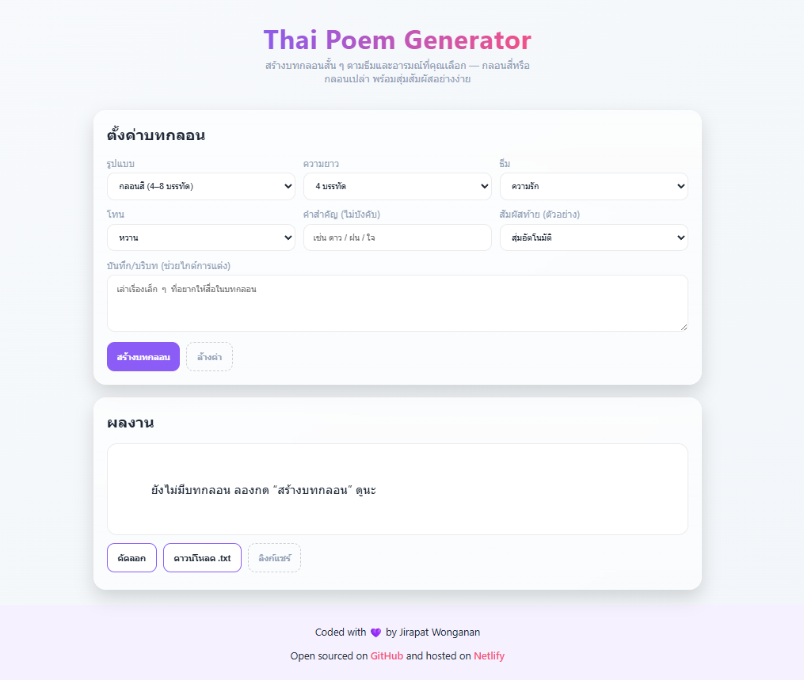

# Thai-Poem Generator 🌸

[](https://thaipoemsgenerator.netlify.app/)
[](LICENSE)

A **web application** that generates original **Thai poems**. Explore Thai poetry creatively with just a few clicks!

---

## 🌐 Live Demo

Try it now: [https://thaipoemsgenerator.netlify.app/](https://thaipoemsgenerator.netlify.app/)

---

## ✨ Features

- Generate beautiful Thai poems instantly.
- User-friendly and responsive web interface.
- Supports multiple poem themes.
- Lightweight and fast.

---

## 💻 Installation (Local)

1. Clone the repository:

```bash
git clone https://github.com/your-username/Thai-poem_generator.git
cd Thai-poem_generator
```

2. Open the `index.html` file in your browser:

- Double-click `index.html`, or
- Right-click → Open with → Browser of your choice.

No additional installation required!

---

## 🖱️ Usage

1. Open the web app in your browser.
2. Enter a theme or keyword for your poem.
3. Click **Generate** to see your Thai poem.
4. Enjoy or copy the poem for your own use.

---

## 🗂️ Folder Structure

```
Thai-poem_generator/
├─ index.html       # Main HTML page
├─ style.css        # Stylesheet
├─ script.js        # JavaScript logic
└─ assets/          # Images or other assets
```

---

## 📸 Screenshot



---

## 🤝 Contributing

Contributions are welcome!

1. Fork the repository.
2. Create a new branch: `git checkout -b feature-name`
3. Make your changes.
4. Commit your changes: `git commit -m "Add new feature"`
5. Push to the branch: `git push origin feature-name`
6. Open a Pull Request.

---

## 📄 License

This project is licensed under the MIT License. See the [LICENSE](LICENSE) file for details.
